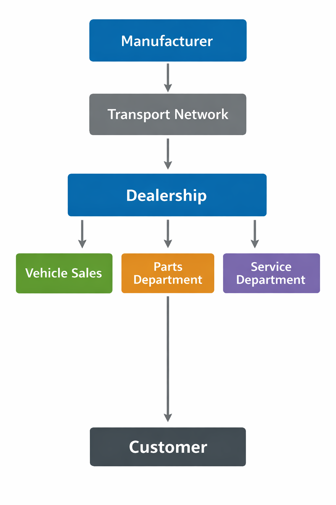

# Supply Chain Management in Automotive Dealership Operations

| Document | Supply Chain Management in Automotive Dealership Operations |
|----------|-------------------------------------------------------------|
| Author   | Edward Vickers |
| Date     | March 3, 2026 |
| Type     | Technical White Paper |

**Read the paper (PDF)**  
[The Rold of Supply Chain Management in a Car Dealership](the-role-of-supply-chain-management-in-a-car-dealership.pdf)

## Overview

This white paper explains how automobile dealerships function as supply chain
distribution nodes within the automotive manufacturing ecosystem.

Although dealerships are commonly perceived as retail organizations,
they coordinate vehicle allocation, service parts logistics, supplier
relationships, and financial risk management through floorplan financing.

| Topics Covered |
|----------------|
| Vehicle distribution networks |
| Dealership parts logistics |
| Inventory forecasting |
| Supply chain risk management |)

## Skills Demonstrated

| Skill | Description |
|------|-------------|
| Technical Writing | Explaining complex supply chain systems clearly |
| Systems Thinking | Analysis of logistics and operational workflows |
| Industry Knowledge | Automotive dealership operations |
| Analytical Writing | Structured explanation of risk and financial metrics |

## Document

📄 **PDF version (recommended)**  
[Download the paper](the-role-of-supply-chain-management-in-a-car-dealership.pdf)

✏️ Editable version  
[Word document](the-role-of-supply-chain-management-in-a-car-dealership.docx)

